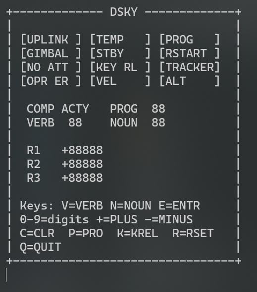
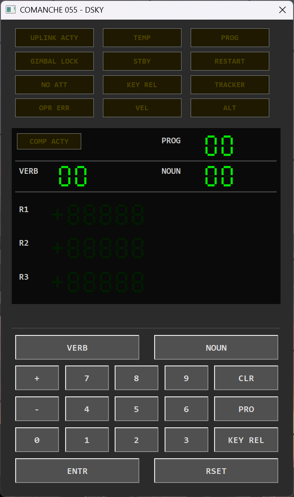

# Comanche055-C89

ANSI C89 port of the Apollo 11 Guidance Computer (AGC), specifically the Command Module (Comanche 055 / Colossus 2A).

Translated from the original AGC assembly source at [chrislgarry/Apollo-11](https://github.com/chrislgarry/Apollo-11).

## Overview

Self-contained, single-threaded console application with no external dependencies or libraries.

Faithfully reproduces AGC fixed-point arithmetic, the executive job scheduler, waitlist timer system, and DSKY verb/noun interface.

## Platform Support

Primary development and support targets are **Windows** and **Linux**.

Frontend availability by platform:

| Frontend | Windows | Linux | macOS |
|---|---|---|---|
| Console | Yes | Yes | Yes |
| GUI | Yes | No | No |
| Web UI | Yes | No | No |

**Implemented:**

- **P00** — CMC Idling
- **V82 / R30** — Orbital parameters (apogee, perigee, TFF)
- **V16N36** — Mission clock
- **V35** — Lamp test
- **V36** — Fresh start
- **V37** — Program select
- **V21–V25** — Data load
- **V06 / V05** — Decimal / octal display

**Stubbed:** All other programs (alarm on selection).

## Build

Source is in `Comanche055-C89/`.

### CMake

```cmd
> cmake -B build
> cmake --build build
```

## Usage

```cmd
> ./comanche055
```

Keyboard mapping is shown on the DSKY display:

| Key | Function |
|-----|----------|
| `V` | VERB |
| `N` | NOUN |
| `E` | ENTR |
| `0`–`9` | Digits |
| `+` / `-` | Sign |
| `C` | CLR |
| `R` | RSET |
| `P` | PRO |
| `K` | KEY REL |
| `Q` | Quit |

Example: type `V 3 5 E` for lamp test, `V 1 6 N 3 6 E` for mission clock.

## Screenshots

<table>
  <tr>
    <td style="text-align: center; padding: 20px; vertical-align: top;">
      
      <br><br><strong>ASCII Terminal Interface</strong>
    </td>
    <td style="text-align: center; padding: 20px; vertical-align: top;">
      
      <br><br><strong>Win32 GDI Interface</strong>
    </td>
  </tr>
</table>

## Roadmap

- [x] Graphical DSKY interface
- [ ] Full program implementations (P20–P25, P30–P39, P40–P47, P51–P53, P61–P67)
- [ ] State vector propagation and orbit integration
- [ ] IMU simulation
- [ ] Telemetry downlink display

## License

Public domain, consistent with the original AGC source code.
